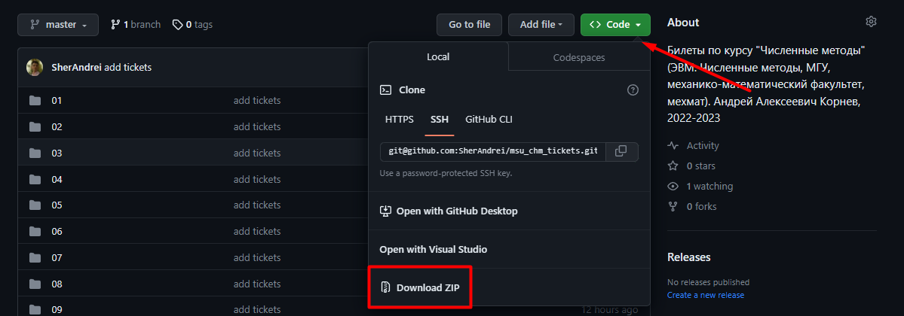

## Билеты по курсу "Численные методы", 2022-2023

### Как собрать

Чтобы собрать `tickets.pdf` файл нужно ввести
```bash
$ make
```

### Как участвовать

##### Если умеешь пользоваться `git`ом и `github`ом

1. Делаешь fork репозитория.
1. Делаешь свои изменения.
1. Кидаешь Pull request.
1. Добиваешься прохождения CI/CD пайплайнов.
1. Сообщаешь мне в личные сообщения.

##### Если __не__ умеешь пользоваться `git`ом и `github`ом

1. Качаешь архив 
1. Делаешь изменения.
1. Отправляешь мне в личные сообщения.

### Правила
1. Файлы с билетами уже созданы, требуется добавить туда свой текст.
1. Изменять `tickets.tex` нужно стараться как можно меньше, добавлять туда что-то если _очень_ нужно.
1. Если нужно добавить картинку к билету, то распологать картинку надо непосредственно рядом с билетом. Если изменяется билет 15, то все картинки должны быть в папке 15.
1. В Pull requestе стараемся на один билет использовать один коммит.
